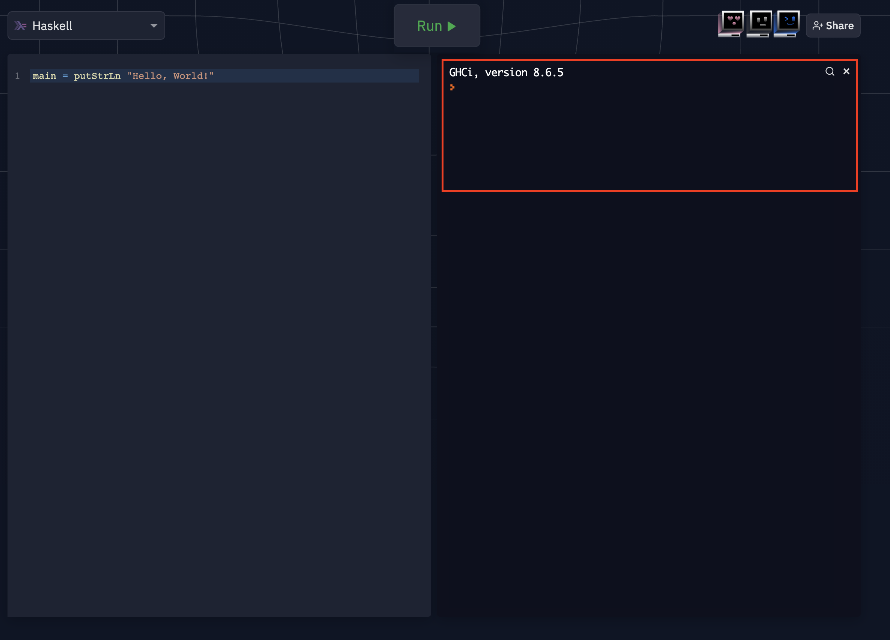

# Introdução

A primeira versão da linguagem Haskell, cujo nome é uma homenagem ao matemático e lógico **Haskell B. Curry**, apareceu em 1987 do esforço para se consolidar vários avanços propostos no paradigma funcional, 
sendo famosa por ser uma linguagem funcional **pura**, de **propósito geral** e por ter características marcantes como **avaliação preguiçosa**, e tipagem **estática**, **forte** e por **inferência**, como discutiremos mais adiante.

Mais do que uma linguagem, Haskell era uma especificação, ou série de especificações, tendo tido várias implementações distintas.
A versão de 98 foi um marco da linguagem, sendo uma versão considerada estável.
Nesta época surgiu o Glasgow Haskell Compiler (GHC), que se tornou o compilador Haskell "padrão".
A versão seguinte da linguagem começou a ser especificada em 2006 e anunciada em 2009, a Haskell 2010. Dentre os principais avanços desta versão está a possibilidade de interagir com código escrito em outras linguagens, via the *foreign function interface* (FFI).

Mas chega de história e vamos colocar a mão na massa vendo alguns exemplos extremamente simples da linguagem.
Para exemplos mais complexos, você deverá instalar o compilador Haskell na sua máquina, seguindo as instruções específicas[^ghc],  mas para pequenos experimentos e exercícios, podendo usar o [Repl.It](https://replit.com/languages/haskell)[^repl]
Do lado direito do sítio, na área marcada em vermelho, digite `ghci` seguido de ++enter++.

[^repl]: REPL é o acrônimo para Read, Evaluate, Print, Loop.

[^ghc]:  Instruções de como instalar o GHC são específicas para cada sistema operacional. Por isso, consulte o sítio https://www.haskell.org/platform/ para instalar o Haskell na sua máquina.



Agora digite as expressões a seguir.

```Haskell
1 + 1

True && True

100 / 10

(10 + 4) * 50

3 * (-2)

2 * -1
```


Estas expressões fazem uso de operadores comuns e se comportam exatamente como você esperaria, depois de ter aprendido a programar em qualquer linguagem, em qualquer paradigma.
Operadores são **açúcar sintático** para funções, a alma da programação funcional.